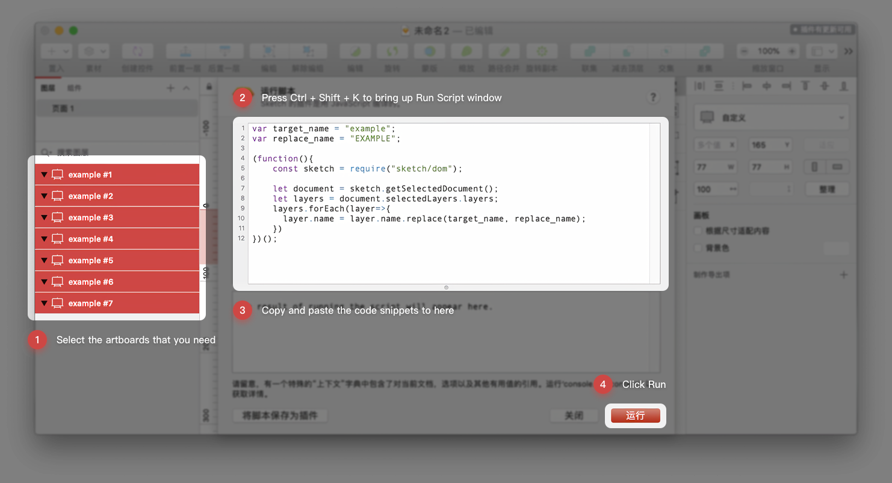

# Sketch Script Snippets

Languages: [English](./README.md) | [简体中文](./README.zh.md)

## Summary

This repository took note the sketch script that frequently used by myself. By sharing these, I hope It can help beginner developers who want to build Sketch plugins. But you still need to learn JavaScript first.

Some of these script snippets may also useful to designers, so I will try to make it easy to use in a more directly way. Even though, I strongly recommend to read the `001 / Batch replace selected artboard names` snippet carefully, it's very detailed descripted all problem you may come up.

## How to use

Launch your Sketch, press `Ctrl + Shift + K`(⌃ + ⇧ + K) to bring up `Run Script` window, then copy and paste the script snippets you need and click `Run`.

For example, copy and paste this: `const sketch = require('sketch'); sketch.UI.message('Hello Sketch');` and click `Run`, you will see a message pop up.

## 001 / Batch replace selected artboard names

### Code

```javascript
var target_name = "example";
var replace_name = "EXAMPLE";

(function(){
    const sketch = require("sketch/dom");

    let document = sketch.getSelectedDocument();
    let layers = document.selectedLayers.layers;
    layers.forEach(layer=>{
      layer.name = layer.name.replace(target_name, replace_name);
    })
})();
```

### Example

Assuming you have a bunch of artboards like this: `example #1`, `example #2`, `example #3`, `example #4` ... and you want to change all the `example #X` to `EXAMPLE #X`. All you need is select all those artboards and bring up `Run Script` window (Ctrl + Shift + K), copy and paste the code snippets above. At last, click `Run`.



If you want to change `example #X` to `Other Example #X`, modify the second line to `var replace_name = "Other Example";` then click `Run` and it will be done.