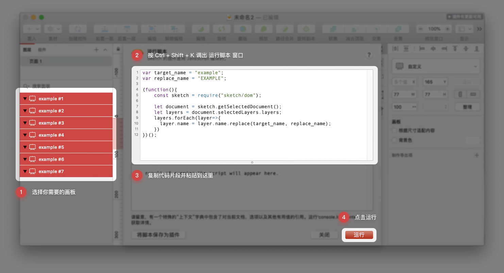

# Sketch Script Snippets

Languages: [English](./README.md) | [简体中文](./README.zh.md)

## 概述

该存储库记录了我自己经常使用的 Sketch 脚本。通过共享这些内容，希望它可以帮助想要构建 Sketch 插件的初学者。但是仍然需要先学习 JavaScript。

其中一些脚本片段也可能对设计师有用，因此，我将尝试使其更易于直接使用。即使如此，我还是强烈建议您仔细阅读 `001 /批量替换所选画板名称` 片段，它非常详细地描述了您可能遇到的所有问题。

## 如何使用

启动 Sketch, 按下 `Ctrl + Shift + K`(⌃ + ⇧ + K) 以调出 `运行脚本` 窗口, 然后复制粘贴你需要的脚本片段并点击 `运行`。

例如，复制并粘贴以下内容：`const sketch = require('sketch'); sketch.UI.message('Hello Sketch');` 然后点击 `运行`, 您将看到一条消息弹出.

## 001 / 批量替换选定的画板名称

### Code

```javascript
var target_name = "example";
var replace_name = "EXAMPLE";

(function(){
    const sketch = require("sketch/dom");

    let document = sketch.getSelectedDocument();
    let layers = document.selectedLayers.layers;
    layers.forEach(layer=>{
      layer.name = layer.name.replace(target_name, replace_name);
    })
})();
```

### Example

假设您有一堆这样的画板：`example #1`, `example #2`, `example #3`, `example #4` ... 而你想改变所有的 `example #X` 为 `EXAMPLE #X`。您所需要做的就是选择这些画板，并打开 `运行脚本` 窗口（Ctrl + Shift + K），复制并粘贴上面的代码。最后点击 `运行`。



如果要将 `example #X` 更改为 `Other Example #X`，请将第二行修改为 `var replace_name = "Other Example";`，然后单击 `运行` 即可完成。